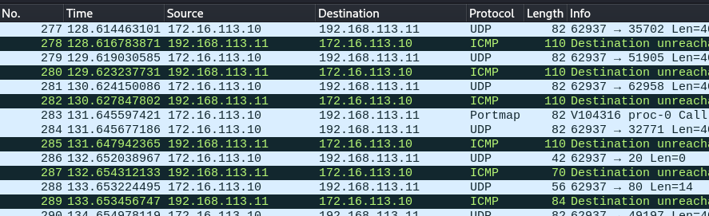

# ホスト存在調査
- ターゲットのIPアドレス範囲において、どのIPアドレスにホストが存在するかを調べる
<br>

調査方法
- ICMPによるホスト存在調査
- TCPによるホスト存在調査
- UDPによるホスト存在調査
<br>

# ポートスキャン
- ネットワーク経由でポート開閉状況を調査

## Nmap
- オープンソースのポートスキャナ
  
[nmapリファレンスガイド](https://nmap.org/book/man.html)
<br>


### Nmapのオプション
```
-sS: TCP SYNスキャン
　3ウェイハンドシェイクを行わないため高速

-ST: TCP Connectスキャン
　3ウェイハンドシェイクを行う
　一般ユーザ実行時のデフォルト

-sN: TCP Nullスキャン
　TCPフラグをまったく立てない

-sF: TCP Finスキャン
　Finフラグのみを立てる

-sX: TCP Xmasスキャン
　FIN, PSH, URGフラグを立てる

-sA: TCP Ackスキャン
　ACKフラグのみを立てる
　パケットフィルタのテスト用

-sW: TCP Windowスキャン
　ACKフラグのみを立てる
　RSTパケットのWindowsサイズで開閉判断

-sM: TCP Maimonスキャン
　FIN及びACKフラグを立てる
```

### Nmapのコマンド例
```
$nmap -n -sS -vv -Pn -pT:[ポート番号] -oA [ファイル名] [ターゲットIP]
```



### Nmapスキャン結果のSTATE
- open: openポートとして反応があった
- closed: closedポートとして反応があった
- filterd: 反応がない
- unfilterd: 反応があったがopenかclosedか不明
- open|filterd: 反応がなかったが、openだと思われる
- closed|filterd: 反応がなかったが、Closedだと思われる

### サービス調査
- TCPやUDPのポートで待ち受けているサービスの種類やバージョンを調査
- サービスが返す情報から判断
- 特定のパターンデータを投げつけ、その反応を見て判断

